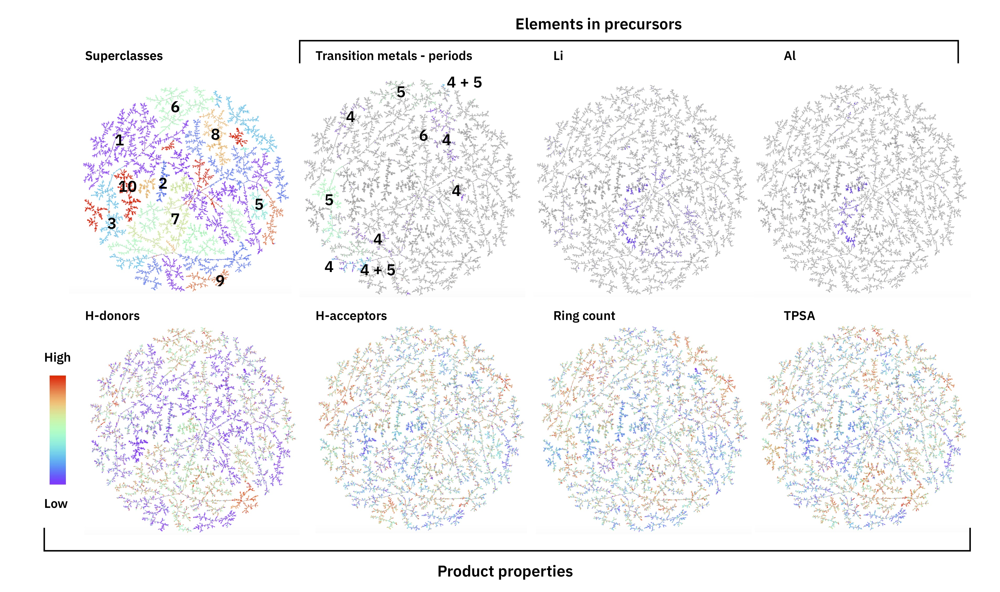

# RXNFP - chemical reaction fingerprints
> This library generates chemical reaction fingerprints from reaction SMILES


## Install

For all installations, we recommend using `conda` to get the necessary `rdkit` and `tmap` dependencies:

### From pypi

```console
conda create -n rxnfp python=3.6 -y
conda activate rxnfp
conda install -c rdkit rdkit=2020.03.3 -y
conda install -c tmap tmap -y
pip install rxnfp
```


### From github
```console
conda create -n rxnfp python=3.6 -y
conda activate rxnfp
conda install -c rdkit rdkit=2020.03.3 -y
conda install -c tmap tmap -y
git clone git@github.com:rxn4chemistry/rxnfp.git
cd rxnfp
pip install -e .
```

## How to use

Compute a fingerprint from a reaction SMILES
```python
```

```python
from rxnfp.transformer_fingerprints import (
    RXNBERTFingerprintGenerator, get_default_model_and_tokenizer, generate_fingerprints
)

model, tokenizer = get_default_model_and_tokenizer()

rxnfp_generator = RXNBERTFingerprintGenerator(model, tokenizer)

example_rxn = "Nc1cccc2cnccc12.O=C(O)c1cc([N+](=O)[O-])c(Sc2c(Cl)cncc2Cl)s1>>O=C(Nc1cccc2cnccc12)c1cc([N+](=O)[O-])c(Sc2c(Cl)cncc2Cl)s1"

fp = rxnfp_generator.convert(example_rxn)
print(len(fp))
print(fp[:5])
```

    256
    [-2.0174953937530518, 1.7602033615112305, -1.3323537111282349, -1.1095019578933716, 1.2254549264907837]


Or for a list of reactions:

```python
rxns = [example_rxn, example_rxn]
fps = rxnfp_generator.convert_batch(rxns)
print(len(fps), len(fps[0]))
```

    2 256


## Reaction Atlas

### Pistachio
The fingerprints can be used to map the space of chemical reactions:


<div style="text-align: center">

<p style="text-align: center;"> <b>Figure:</b> Annotated Atlas of the Pistachio test set generated with <a href="https://tmap.gdb.tools">TMAP</a>. </p>
</div>


### Schneider 50k set - tutorial

In the notebooks, we show how to generate an interative reaction atlas for the Schneider 50k set. The end result is similar to this **[interactive Reaction Atlas](https://rxn4chemistry.github.io/rxnfp//tmaps/tmap_ft_10k.html)**.

Where you will find different reaction properties highlighted in the different layers:

<div style="text-align: center">

<p style="text-align: center;"> <b>Figure:</b> Reaction atlas of 50k data set with different properties highlighted. </p>
</div>

## USPTO 1k TPL (reaction classification data set)

We introduce a new data set for chemical reaction classification called USPTO 1k TPL. USPTO 1k TPL is derived from the [USPTO data base](https://figshare.com/articles/Chemical_reactions_from_US_patents_1976-Sep2016_/5104873) by Lowe. It consists of 445k reactions divided into 1000 template labels. The data set was randomly split into train/valid 90% and test 10%. The labels were obtained by atom-mapping the USPTO data set with [RXNMapper](http://rxnmapper.ai), then applying the [template extraction workflow](https://github.com/reymond-group/CASP-and-dataset-performance) by Thakkar et al. and finally, selecting reactions belonging to the 1000 most frequent template hashes. Those template hashes were taken as class labels. Similarly to the Pistachio data set, USPTO 1k TPL is strongly imbalanced.

The data set can be downloaded from: [MappingChemicalReactions](https://ibm.box.com/v/MappingChemicalReactions).

## Citation 

Our work was first presented in the NeurIPS 2019 workshop for [Machine Learning and the Physical Sciences](https://ml4physicalsciences.github.io). And has been published after multiple updates in 2021 in [Nature Machine Intelligence (free access link)](http://rdcu.be/cenmd).

```
@article{schwaller2021mapping,
  title={Mapping the space of chemical reactions using attention-based neural networks},
  author={Schwaller, Philippe and Probst, Daniel and Vaucher, Alain C and Nair, Vishnu H and Kreutter, David and Laino, Teodoro and Reymond, Jean-Louis},
  journal={Nature Machine Intelligence},
  volume={3},
  number={2},
  pages={144--152},
  year={2021},
  publisher={Nature Publishing Group}
}
```

RXNFP has been developed in a collaboration between IBM Research Europe and the [Reymond group](http://gdb.unibe.ch) at the University of Bern. The classification models are used on the [RXN for Chemistry](https://rxn.res.ibm.com) platform.

Our publication is part of the Nature Portfolio ["Synthesis and enabling technologies" collection](https://www.nature.com/collections/ijabjccjec) and was featured in a News & Views on [Transformers for future medicinal chemists](https://www.nature.com/articles/s42256-021-00299-x). 

Moreover, the `rxnfp` code was reused to train new models on different data as described in [Reusability report: Learning the language of synthetic methods used in medicinal chemistry](https://www.nature.com/articles/s42256-021-00367-2).
